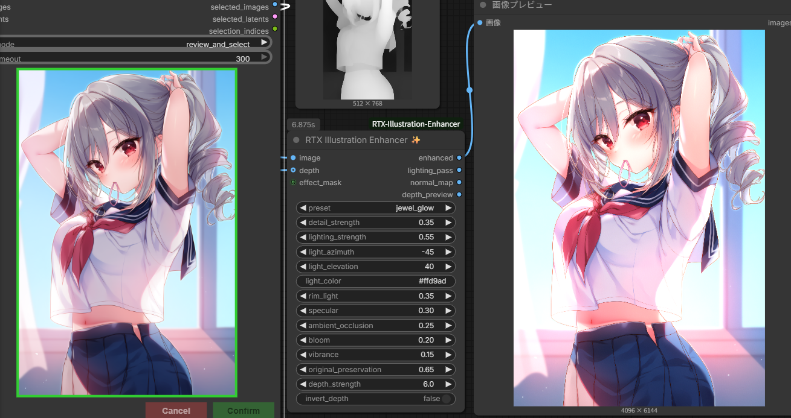

# RTX Illustration Enhancer for ComfyUI

RTX Video Super Resolution の後段で使う、イラスト向けの高速な疑似レイトレーシング／豪華化ノードです。
外部AIモデルを追加せず、ComfyUIに含まれるPyTorchだけで動作します。

## 主な機能

- 深度からの法線推定
- 方向光、リムライト、鏡面ハイライト
- 疑似アンビエントオクルージョン
- Bloom、彩度、細部強調
- `light_color` のカラーコード入力とカラーパレット選択
- IC-Light用の照明プロンプト生成
- IC-Light出力から原画の色・線・細部を復元する仕上げノード
- 任意の深度画像とエフェクトマスク
- 静止画およびIMAGEバッチ（動画フレーム）対応
- `subtle`、`anime_luxury`、`cinematic`、`jewel_glow`、`dramatic` プリセット

これは3Dシーンを使う物理的なレイトレーサーではありません。単一画像の深度と法線を推定して照明効果を
近似するため、原画を保ちやすく、生成モデルより高速です。「新しい宝石や衣装模様を描き足す」生成処理は
行わないため、その用途では本ノードの後にIC-Lightや低denoiseのimg2imgを接続してください。

## インストール

1. このフォルダーを `ComfyUI/custom_nodes/ComfyUI-RTX-Illustration-Enhancer` にコピーします。
2. ComfyUIを再起動します。
3. `RTX Illustration / RTX Illustration Enhancer ✨` を追加します。

追加パッケージのインストールは不要です。
`🎨 choose light color` ボタンを押すとカラーパレットが開き、選択した色が
`light_color` の `#RRGGBB` カラーコードへ自動反映されます。カラーコードの直接入力も引き続き利用できます。

## 推奨接続

`Load Image → RTX Video Super Resolution → RTX Illustration Enhancer → Save Image`

精度を上げる場合：

`Depth Anything等の深度出力 → depth`

顔や線画だけ原型を守る場合：

`任意のMASK → effect_mask`（白い部分にだけ効果）

## 入出力

- `enhanced`: 最終画像
- `lighting_pass`: 照明の確認用
- `normal_map`: 推定法線
- `depth_preview`: 使用した深度

`preset=custom` では各強度がそのまま使われます。その他のプリセットは入力した各強度に
プリセット固有の倍率を掛けるため、プリセット選択後もすべての項目を微調整できます。

## 最初に試す設定

- 控えめ：`subtle`
- アニメイラスト：`anime_luxury`
- 逆光の強い画面：`cinematic`
- 宝石・魔法・発光表現：`jewel_glow`
- 強い陰影：`dramatic`

効果が強すぎる場合は `custom` に切り替え、`original_preservation` を0.75以上にしてください。

## IC-Light連携（v0.2.0）

IC-Light本体は同梱していません。ComfyUI-Managerから
[`kijai/ComfyUI-IC-Light`](https://github.com/kijai/ComfyUI-IC-Light) を別途インストールしてください。
IC-Light未導入でも、このパッケージのノードは通常どおり読み込まれます。

### IC-Light Prompt Builder 💡

光源方向、スタイル、時間帯、色、強度を選択すると、IC-Lightへ渡す
`positive_prompt` と `negative_prompt` を生成します。出力を通常のCLIP Text Encodeへ接続してください。

### IC-Light Detail Finish ✨

`original` にIC-Light処理前の画像、`ic_light_image` にIC-Light処理後の画像を接続します。

- `relight_strength`: IC-Light結果を使う割合
- `detail_recovery`: 元画像の線や高周波ディテールを戻す量
- `color_preservation`: 元画像の配色を保持する量
- `highlight_protection`: 白飛びを抑える量
- `effect_mask`: 白い部分だけIC-Light結果を適用

推奨順序：

`入力 → RTX Video Super Resolution → IC-Light → IC-Light Detail Finish → RTX Illustration Enhancer`

